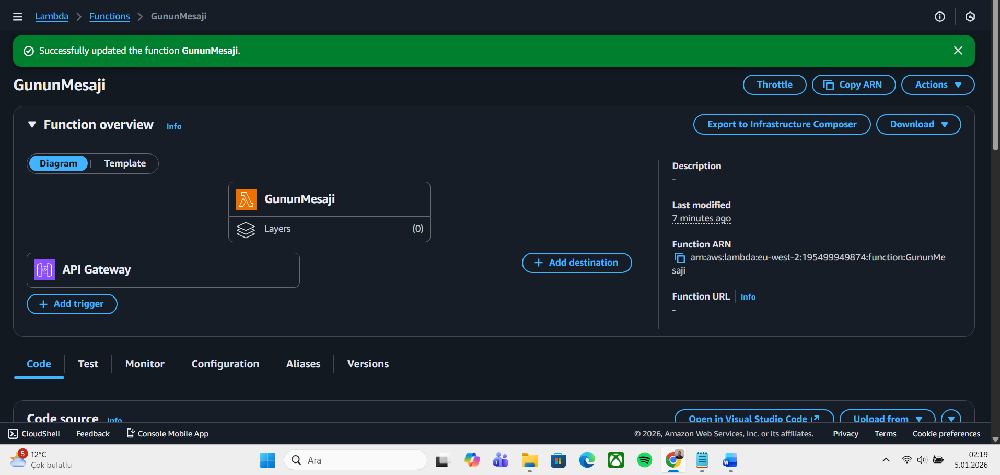
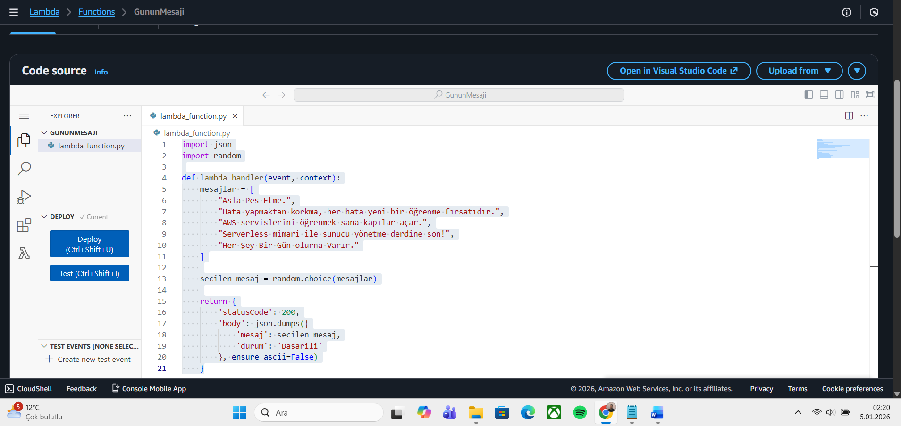
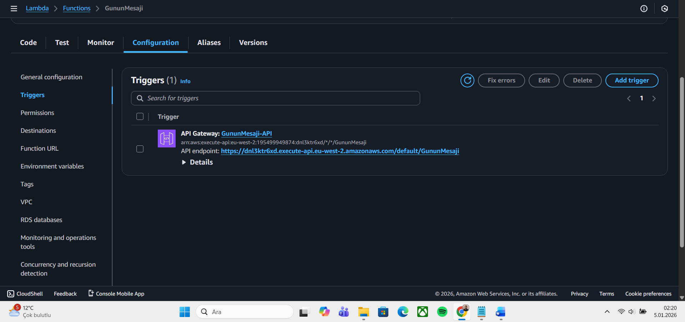
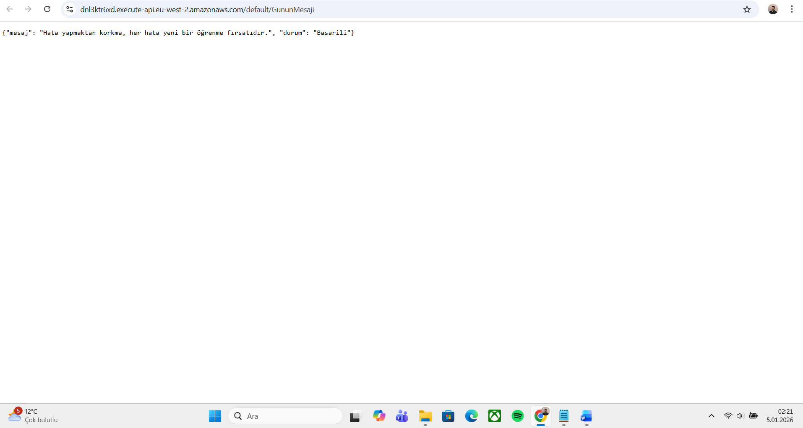
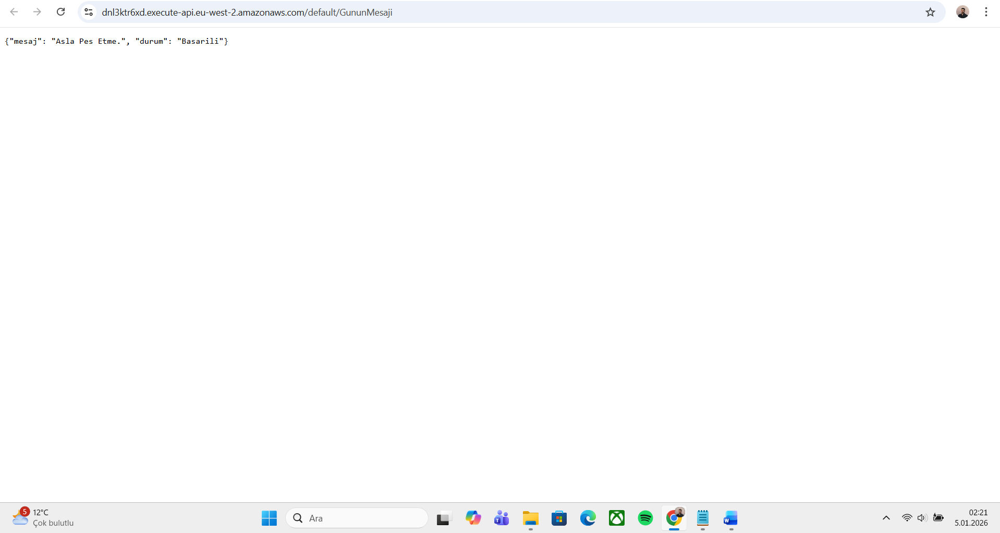
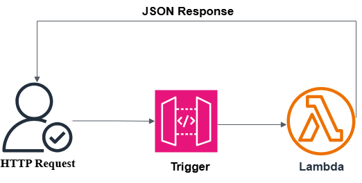

# Serverless-Random-Quote-API

Project Title: Serverless Random Quote API

Architecture: API Gateway -> AWS Lambda (Python)

Description: "Bu projede AWS Free Tier sınırları içinde kalarak, sunucu yönetimi gerektirmeyen bir API geliştirdim."

Ekran Görüntüleri

